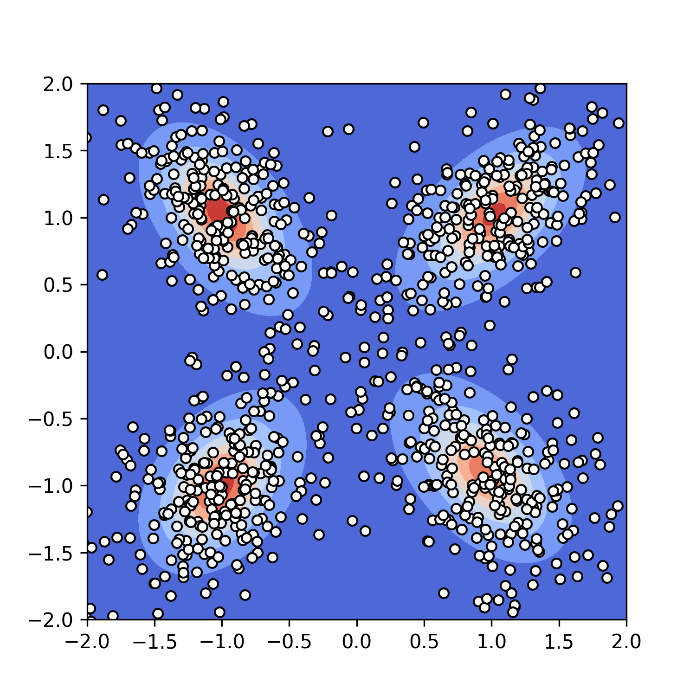
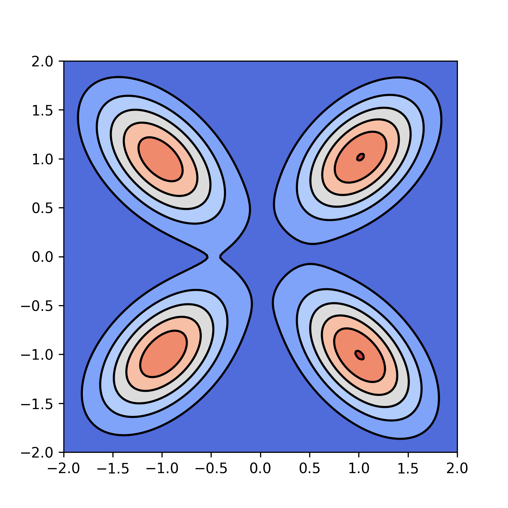

# Expectation Maximization for Student-t Mixture Models

*Keywords: Student-t distribution, mixture model, Expectation Maximization, PyTorch*

DOF of 2             |  DOF of 100
:-------------------------:|:-------------------------:
 | 

Run `src/four_clusters.py` to reproduce these figures.

## Intro

This is a minimal Python package for fitting Student-t Mixture Models (STMM) to multi-dimensional datasets using the Expectation-Maximization (EM) algorithm. It has been *completely* vectorized using PyTorch (try to find a loop!) and is hence very, very fast compared to a naive loop-based implementation. 

Positive things:

- It runs in reasonable time even even when the dataset is large (e.g., 100,000).
- It checks whether log-likelihood increases at each iteration of EM.
- It tests the vectorized version in PyTorch against the loop version in Numpy, which is slower but easier to debug.

Limitations:

- It uses naive initialization strategies for parameters; there must be smarter ones out there.
- It does not support learning the degree-of-freedom parameter(s), but I plan to include it in the near future. 
- It has not been tested thoroughly on datasets with dimensions more than 2.
- It does not have mechanisms for spotting / warning numerical instabilities (scikit-learn does have these mechanisms for GMMs, which is wonderful), which tend to happen when the dimension of data points is large relative to the number of data points.

Overall, this package is for (1) pedagogy (you can expect good commentary and clean code) and (2) proving the possibility of vectorizing EM for STMM. You can expect good performance on datasets with a small number of dimensions and a large number of data points (i.e., the most numerically stable case). Please be cautious if you are using it for other purposes like research.

In code, I tried to follow the notation found in the original paper:

```bibtex
@article{peel2000robust,
  title={Robust mixture modelling using the t distribution},
  author={Peel, David and McLachlan, Geoffrey J},
  journal={Statistics and computing},
  volume={10},
  number={4},
  pages={339--348},
  year={2000},
  publisher={Springer}
}
```

This package is motivated by an exercise in Machine Learning: A Probabilistic Perspective by Kevin P. Murphy. I'd like to thank him for his great book.

## Example

Here's an example of fitting a 4 component STMM on a 2-dimensional dataset containing 100,000 examples:

```python
from emmixstudent import MixtureOfStudents

model = MixtureOfStudents(num_components=3, num_dimensions=2)
lower_bounds = model.fit(data)  # contains the lower bound to observed data log likelihood per timestep

# do some visualization here
```
