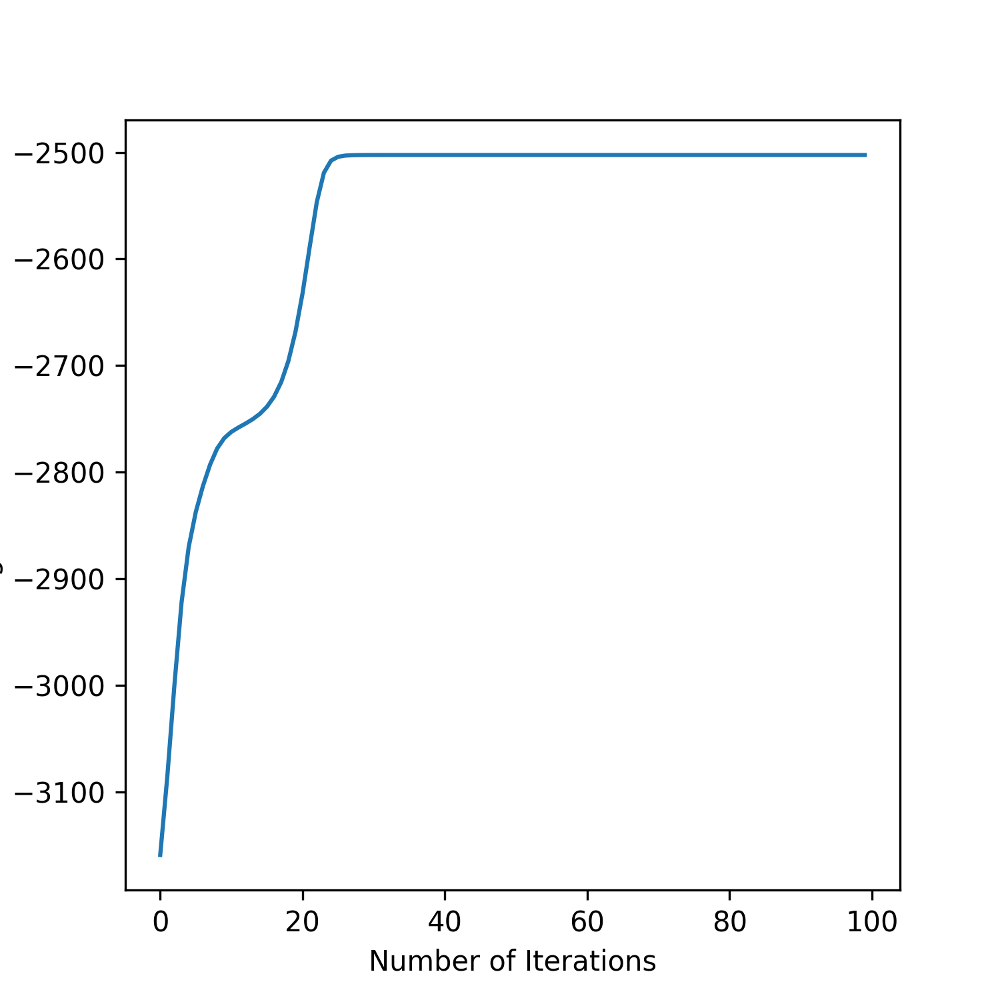
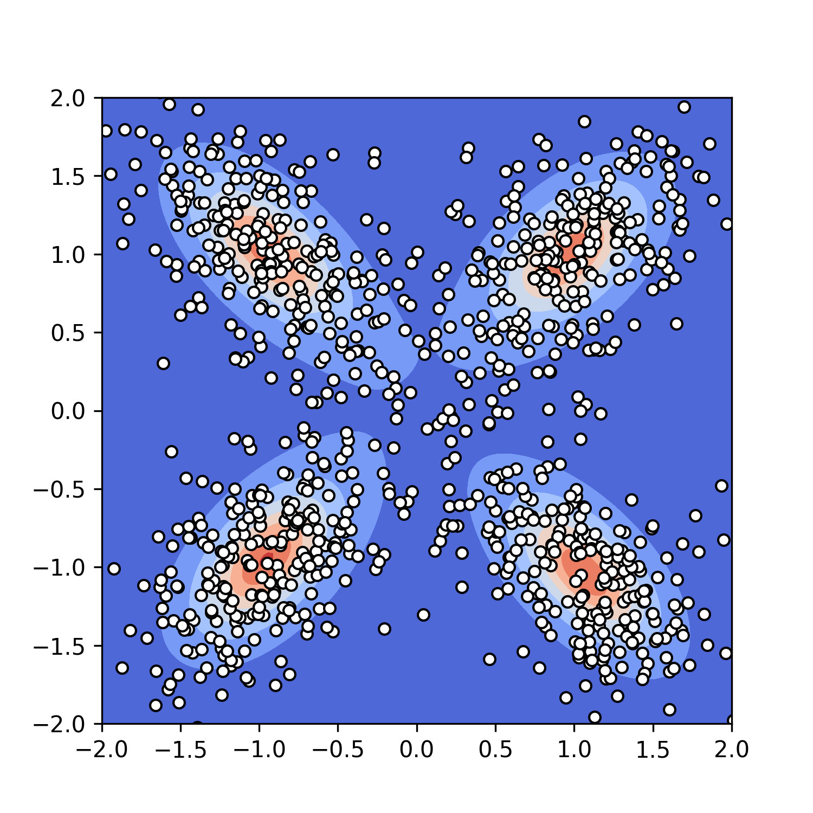
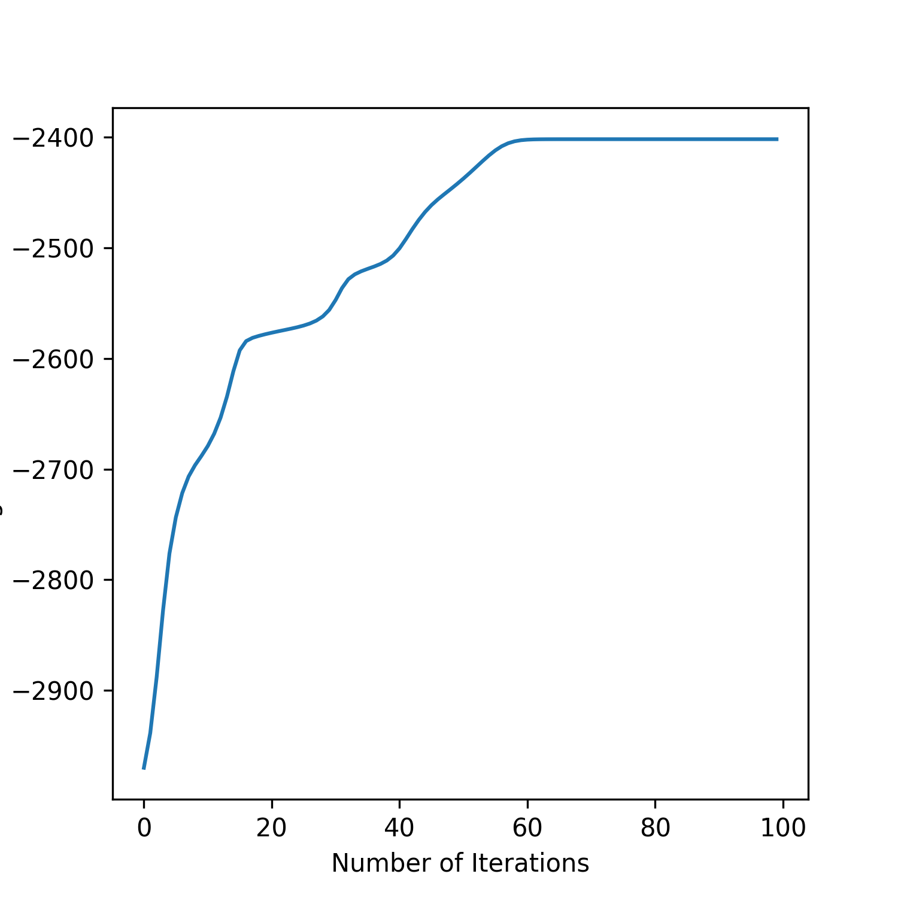
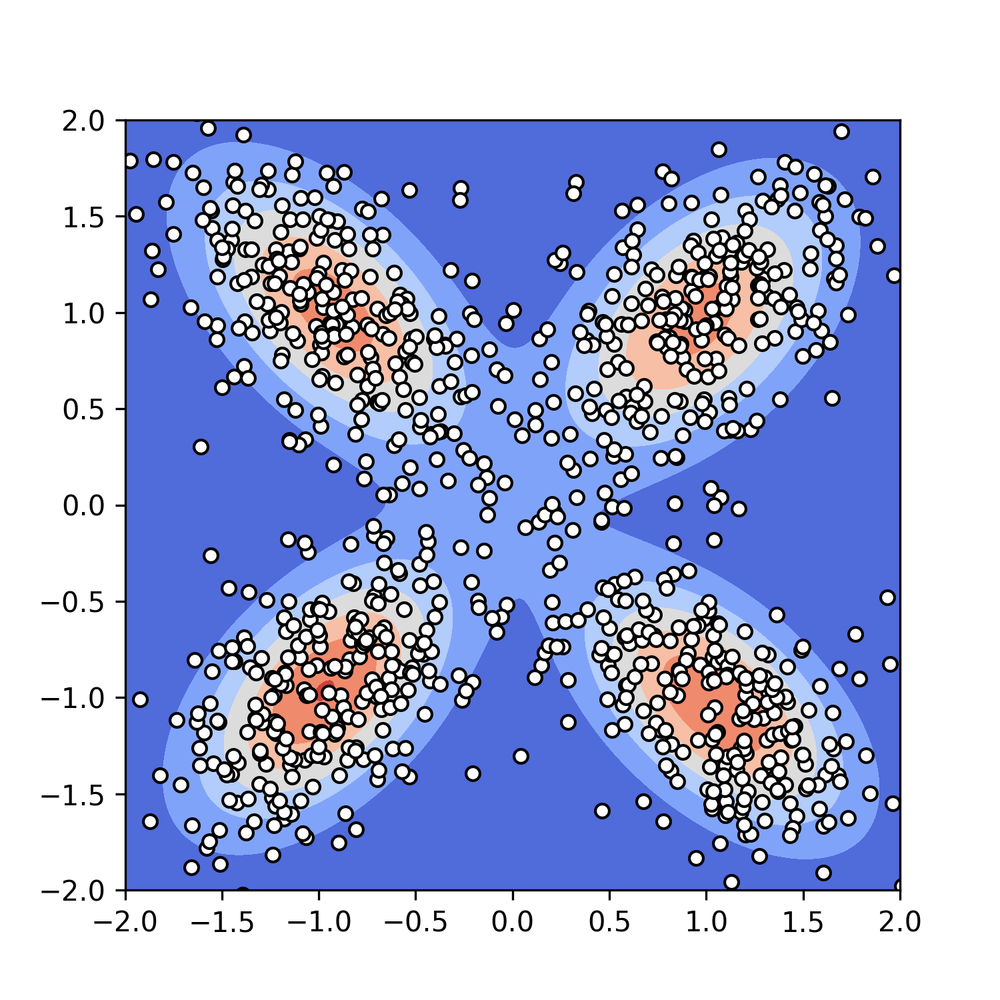

# Expectation Maximization for Student-t Mixture Models

*Keywords: Student-t distribution, mixture model, Expectation Maximization, PyTorch*

*Zhihan @ Feb, 2022*

DOF of 2 LL | DOF of 2 Viz |  DOF of 100 LL | DOF of 100 Viz
:-------------------------:|:-------------------------:
 |  |  | 

Run `src/four_clusters.py` to reproduce these figures. Scroll down for other examples.

## Intro

This is a minimal Python package for fitting Student-t Mixture Models (STMM) to multi-dimensional datasets using the Expectation-Maximization (EM) algorithm. It has been *completely* vectorized using PyTorch (try to find a loop!) and is hence very, very fast compared to a naive loop-based implementation. 

Positive things:

- It includes a very detailed derivation of the algorithm in PDF using the notation of the cited paper (see below). The paper itself
is great, but it does have some big logic leaps that took me a while to parse.
- It can learn the degree-of-freedom (DOF) parameter as well (default option is no).
- It runs fast even when the dataset is very large (e.g., 100,000), when DOF is fixed.
- It checks whether log-likelihood increases at each iteration of EM.
- It tests the vectorized version in PyTorch against the loop version in Numpy, which is slower but easier to debug.

Limitations:

- It uses naive initialization strategies for parameters; there must be smarter ones out there.
- It has not been tested thoroughly on datasets with dimensions more than 2.
- It does not have mechanisms for spotting / warning numerical instabilities (scikit-learn does have these mechanisms for GMMs, which is wonderful), which tend to happen when the dimension of data points is large relative to the number of data points.

Overall, this package is for (1) pedagogy (you can expect good commentary and clean code) and (2) proving the possibility of vectorizing EM for STMM. You can expect good performance on datasets with a small number of dimensions and a large number of data points (i.e., the most numerically stable case). Please be cautious if you are using it for other purposes like research.

In code, I tried to follow the notation found in the original paper:

```bibtex
@article{peel2000robust,
  title={Robust mixture modelling using the t distribution},
  author={Peel, David and McLachlan, Geoffrey J},
  journal={Statistics and computing},
  volume={10},
  number={4},
  pages={339--348},
  year={2000},
  publisher={Springer}
}
```

This package is motivated by an exercise in Machine Learning: A Probabilistic Perspective by Kevin P. Murphy. I'd like to thank him for his great book.

## Requirements

```
pip install numpy scipy torch pyro matplotlib
```

## Examples


## FAQs

*Why are you using PyTorch for the vectorized version & Numpy for the loop version?*

**Numpy and Scipy doesn't have a neat way for evaluating multiple data vectors simulatenously
under multiple multivariate Student-t distributions.** 

I'm grateful that:
 
- PyTorch's developers have actually
thought about this and have made this possible for Multivariate Gaussian, from which I borrowed
the batch-mahalanobis code. 
- pyro's team took the time to develop Multivariate Student-t in PyTorch's API. 

If it weren't for these foundational stuff, I wouldn't have been able to develop this package. So, thanks a lot to them! 

There are certainly things that I wrote in PyTorch that I could do in Numpy - like simple 
matrix multiplications - but I wanted to be consistent. 
 
*Could you talk more about learning the DOF parameter?*

Two things.

First: Compared to means and covariance matrices, DOF parameters are rather
hard to interpret, since their values don't really change the distributions'
location or spread. And, since EM does not guarantee to reach a global
optimum, their learned values will depend on their initial values. By
my (limited) observation, their learned values are larger than their initial values. In short,
it's rather hard to make sure my code is doing exactly the right thing.

Second: One cannot represent the MLE solution for DOF parameters in closed form.
Therefore, if DOF parameters are learned, each round of EM would
involve an inner optimization loop and would hence be much slower.